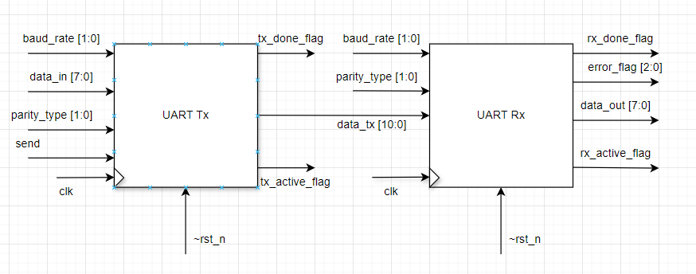
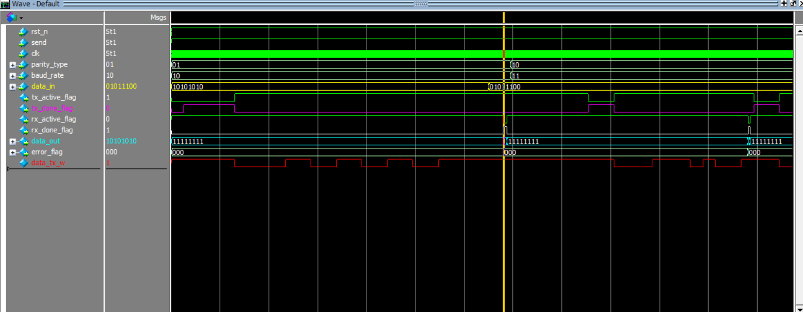
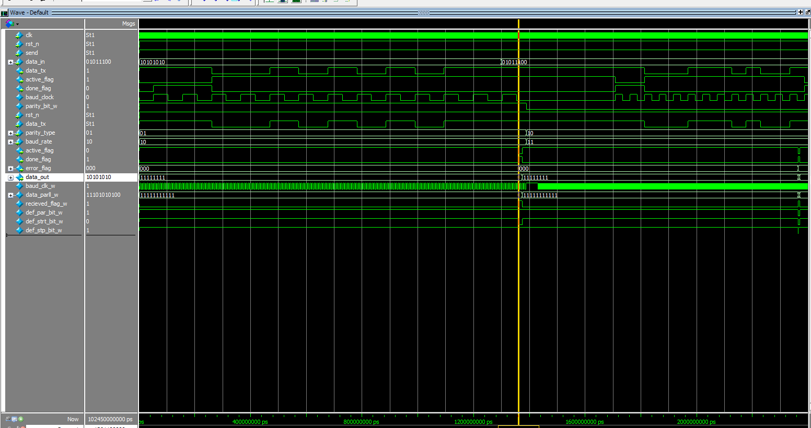
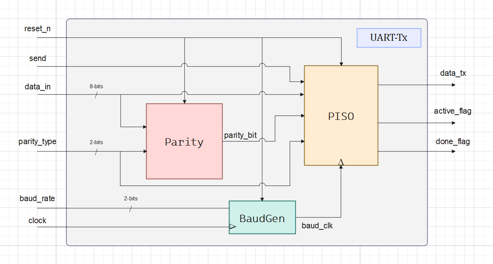
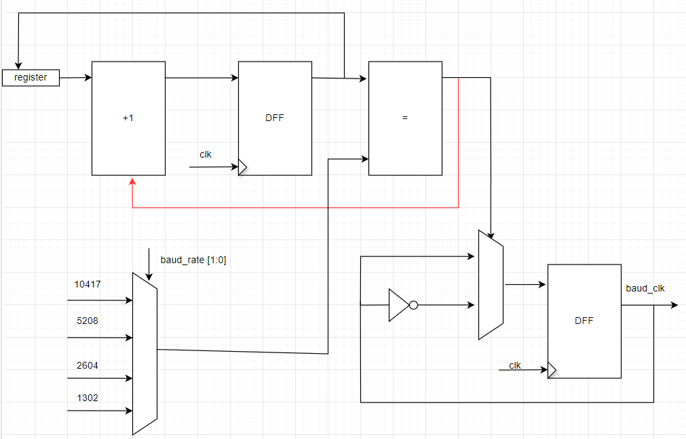
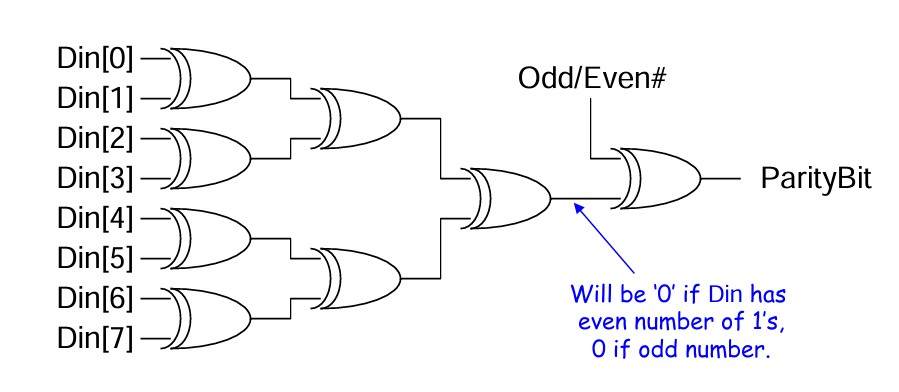
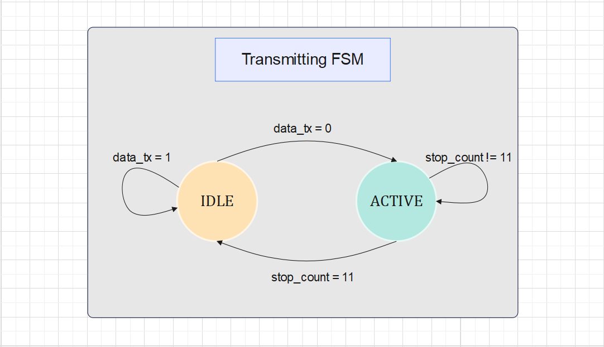
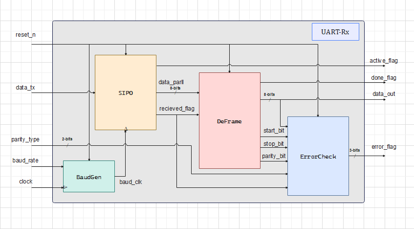
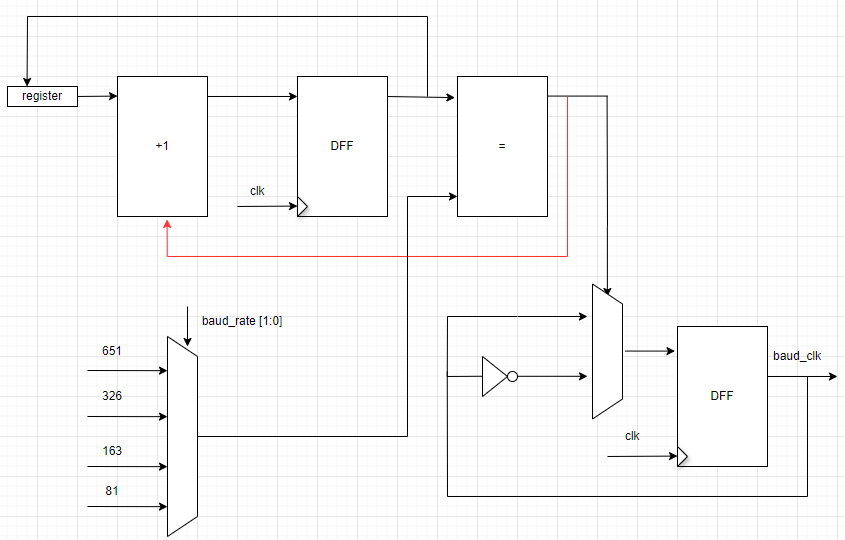
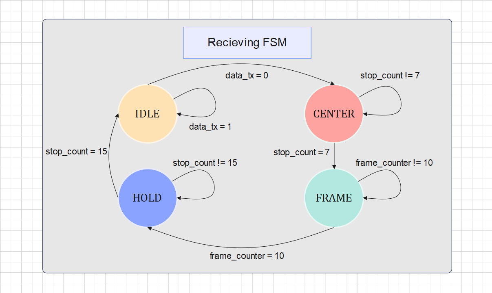

# UART

## Full UART implementation using SystemVerilog

### Summary

***UART*** stands for ***Universal Asynchronous Receiver/Transmitter***. It’s not a communication protocol like SPI and I2C, but a physical circuit in a microcontroller, or a stand-alone IC. A UART’s main purpose is to transmit and receive serial data.
In UART communication, two UARTs communicate directly with each other. The transmitting UART converts parallel data from a controlling device like a CPU into serial form, and transmits it in serial to the receiving UART, which then converts the serial data back into parallel data for the receiving device. Only two wires are needed to transmit data between two UARTs. Data flows from the transmitting UART's Tx pin to the receiving UART's Rx pin.

*   *For more information about UART, check [BASICS OF UART COMMUNICATION](https://www.circuitbasics.com/basics-uart-communication/).*

**Table of contents**

- [Full Duplex UART](#full-duplex-uart)
- [UART-Tx](#uart-tx)
    - [Baud Rate Generator Unit](#baud-rate-generator-unit)
    - [Parity Bit Unit](#parity-bit-unit)
    - [PISO Unit](#piso-unit)
        - [Tx FSM](#tx-fsm)
    - [Tx Top Module](#tx-top-module)
- [UART-Rx](#uart-rx)
    - [Oversampling Unit](#oversampling-unit)
    - [SIPO Unit](#sipo-unit)
        - [Rx FSM](#rx-fsm)
    - [DeFrame Unit](#deframe-unit)
    - [Error Check Unit](#error-check-unit)
    - [Rx Top Module](#rx-top-module)
- [References](#References)

### Full Duplex UART

*   Implemented a full duplex uart body from the two top modules [UART_Tx.sv](https://github.com/106210049/UART-SystemVerilog/blob/main/Source%20code/Full%20UART/result/UART_Tx.sv) and [UART_Rx](https://github.com/106210049/UART-SystemVerilog/blob/main/Source%20code/Full%20UART/result/UART_Rx.sv).

*   Design module *[UART.sv](https://github.com/106210049/UART-SystemVerilog/blob/main/Source%20code/Full%20UART/result/design.sv)*
*   Test bench *[UART_test.v](https://github.com/106210049/UART-SystemVerilog/blob/main/Source%20code/Full%20UART/result/design.sv)* 
My code in EDA Playground: [UART](https://edaplayground.com/x/cp_y)
*   The wave form:

### UART-Tx

*   ***UART-Tx full architecture:***

#### Baud Rate Generator Unit

***Baud Rate*** is the rate at which the number of signal elements or changes to the signal occurs per second when it passes through a transmission medium. The higher the baud rate, the faster the data is sent/received.

This unit supports four possible baud rates:

*   Baud rate of 2400 bps
*   Baud rate of 4800 bps
*   Baud rate of 9600 bps
*   Baud rate of 19200 bps

**Notes:**
*   The latter two are the most common.
*   The values of the timer calculated for the baud rates are for the **50MHz** system's clock, those values need to be re-calculated for different clock frequencies.

*   Design module *[BaudGenTx.sv](https://github.com/106210049/UART-SystemVerilog/blob/main/Source%20code/UART_Tx/Baud_Gen_Tx.sv)*
*   Test bench *[BaudTest.sv](https://github.com/106210049/UART-SystemVerilog/blob/main/Source%20code/UART_Tx/BaudGen_Tx_tb.sv)*
My code in EDA Playground: [BaudGenTx](https://edaplayground.com/x/Rtrv)

#### Parity Bit Unit

***Parity bit*** is a method of checking if the data packet is sent correctly by calculating the number of 1's in the packet and providing the parity bit according to the ***parity type***, then checking if the Received data packet has the same parity bit.

This unit supports three parity types:

*   No Parity
*   Odd Parity
*   even Parity

**Notes:**

*   This method can discover a one-bit error, if two bits are flipped concurrently the packet will be considered the correct packet.
*   The default case is that there is no parity bit. 

*   Design module *[Parity.v](https://github.com/106210049/UART-SystemVerilog/blob/main/Source%20code/UART_Tx/Parity_Bit.sv)*
*   Test bench *[ParityTest.v](https://github.com/106210049/UART-SystemVerilog/blob/main/Source%20code/UART_Tx/ParityGen_tb.sv)*
My code in EDA Playground: [Parity Bit Gen](https://edaplayground.com/x/E5CZ)

#### PISO Unit

***Parallel-Input-Serial-Output*** shift register, this unit is responsible for converting the data from a parallel bus to serial data in a single wire, it is controlled by an ***FSM logic*** to do so, It takes about 11 baud_clk cycles to send the whole data packet.
It is the heart of the transmission unit.

##### Tx FSM

**Notes:**

*   The **Done Flag** indicates whether the transmission is done or not, to enable another packet to get ready to be sent.
*   The **Active Flag** indicates whether the transmitter is in progress or an **idle state**.

*   Design module *[PISO.v](https://github.com/106210049/UART-SystemVerilog/blob/main/Source%20code/UART_Tx/PISO.sv)*
*   Test bench *[PisoTest.v](https://github.com/106210049/UART-SystemVerilog/blob/main/Source%20code/UART_Tx/PISO_tb.sv)*
My code in EDA Playground: [PISO](https://edaplayground.com/x/QzEh)

#### Tx Top Module

The top module ***Tx*** connects all the architecture.

*   See the full architecture: *[UART-Tx](#uart-tx)*
*   Design module *[UART_Tx.sv](https://github.com/106210049/UART-SystemVerilog/blob/main/Source%20code/UART_Tx/UART_Tx.sv)*
*   Test bench *[UART_TX_tb.sv](https://github.com/106210049/UART-SystemVerilog/blob/main/Source%20code/UART_Tx/UART_Tx_tb.sv)*
My code in EDA Playground: [UART_Tx](https://edaplayground.com/x/tYYV)

### UART-Rx

*   ***UART-Rx full architecture:***

#### Oversampling Unit

It is a ***Baud Rate Generator***, but uses a sampling rate of 16 times the baud rate, which means that each serial bit is sampled 16 times, this methodology shifts the time to read the data to the center of the bit.

*   Design module *[BaudGenRx.sv](https://github.com/106210049/UART-SystemVerilog/blob/main/Source%20code/UART_Rx/result/BaudGen_Rx.sv)*
*   Test bench *[BaudTest.sv](https://github.com/MuhammadMajiid/UART/blob/main/Code/UART-Rx/BaudTest.v)*
*   *For more information about the oversampling used in this project, check [Oversampling methodology](https://robo-tronix.weebly.com/uploads/2/3/2/1/23219916/uart_design_doc.pdf).*

#### SIPO Unit

***Serial-Input-Parallel-Output*** shift register, this unit is responsible for converting the data from serial data to the parallel bus, it is controlled by an ***FSM logic*** to do so, It takes about 11 baud_clk cycles to Receive the whole data packet.
It is the heart of the Receiver unit.

##### Rx FSM
The oversampling scheme works as follows:
1) Wait until the incoming signal becomes 0, the beginning of the start bit, and
then start the sampling tick counter.
2) When the counter reaches 7, the incoming signal reaches the middle point of the
start bit. Clear the counter to 0 and restart.
3) When the counter reaches 15, the incoming signal progresses for one bit and
reaches the middle of the first data bit. Retrieve its value, shift it into a register,
and restart the counter.
4) Repeat step 3 n-1 more times to retrieve the remaining data bits.
5) If the optional parity bit is used, repeat step 3 one time to obtain the parity bit.
6) Repeat step 3 n more times to obtain the stop bits. 

*   Design module *[SIPO.sv](https://github.com/106210049/UART-SystemVerilog/blob/main/Source%20code/UART_Rx/result/SIPO.sv)*
*   Test bench *[SipoTest.sv](https://github.com/106210049/UART-SystemVerilog/blob/main/Source%20code/UART_Rx/result/SIPO_tb.sv)*
My code in EDA Playground: [SIPO](https://edaplayground.com/x/LuF_)

#### DeFrame Unit

De-Frame unit is responsible for separating the frame into four main parts: **Strat bit**, **Data packet**, **Parity bit**, **Stop bit**, it is the final stage, regardless of the [Error Check Unit](#error-check-unit), in the Receiver.

*   Design module *[DeFrame.sv](https://github.com/106210049/UART-SystemVerilog/blob/main/Source%20code/UART_Rx/result/Deframe.sv)*
*   Test bench *[DeFrameTest.sv](https://github.com/106210049/UART-SystemVerilog/tree/main/Source%20code/UART_Rx/result)*
My code in EDA Playground: [Deframe](https://edaplayground.com/x/PVHb)

#### Error Check Unit

This unit is indispensable, noise is everywhere and it is most likely that at some time the data will get affected by it, thus we always need some sort of confirmation that the data is sent correctly, if not it will be re-sent. This unit supports three error flags:

1.  **Parity Error**: re-checks the data sent by the Tx unit, produces a parity bit, then compares it with the one from the *DeFrame* unit, it rises to logic 1 if they are not equal.
2.  **Start Error**: re-checks the start bit, whether it equals logic 0 or not, it rises to logic 1 if they are not equal.
3.  **Stop Error**: re-checks the start bit, whether it equals logic 1 or not, it rises to logic 1 if they are not equal.

*   Design module *[ErrorCheck.v](https://github.com/106210049/UART-SystemVerilog/blob/main/Source%20code/UART_Rx/result/Error_Check.sv)*
*   Test bench *[CheckTest.v](https://github.com/106210049/UART-SystemVerilog/blob/main/Source%20code/UART_Rx/result/Error_Check_tb.sv)*
My code in EDA Playground: [ErrorCheck](https://edaplayground.com/x/7Wrs)

#### Rx Top Module

The top module ***Rx*** connects all the architecture.

*   See the full architecture: *[UART-Rx](#uart-rx)*
*   Design module *[UART_Rx.sv](https://github.com/106210049/UART-SystemVerilog/blob/main/Source%20code/UART_Rx/result/UART_Rx.sv)*
*   Test bench *[RxTest.sv](https://github.com/106210049/UART-SystemVerilog/blob/main/Source%20code/UART_Rx/result/testbench.sv)*
My code in EDA Playground: [UART_Rx](https://edaplayground.com/x/SYDd)

  ### References: 
  Github: *[UART](https://github.com/MuhammadMajiid/UART/tree/main?tab=readme-ov-file)*
  
  Document: 
  1. A Hardware Communication Protocol Understanding Universal Asynchronous Receiver/Transmitter- Analog Devices
  2. [BASICS OF UART COMMUNICATION](https://www.circuitbasics.com/basics-uart-communication/).
  3. [Oversampling methodology](https://robo-tronix.weebly.com/uploads/2/3/2/1/23219916/uart_design_doc.pdf).
